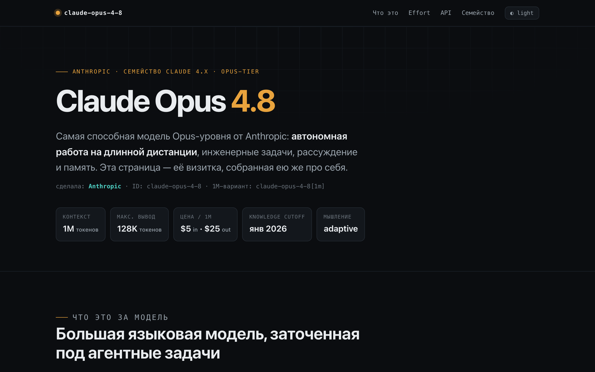
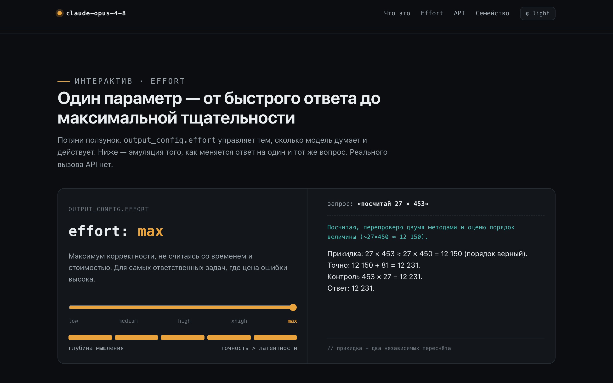
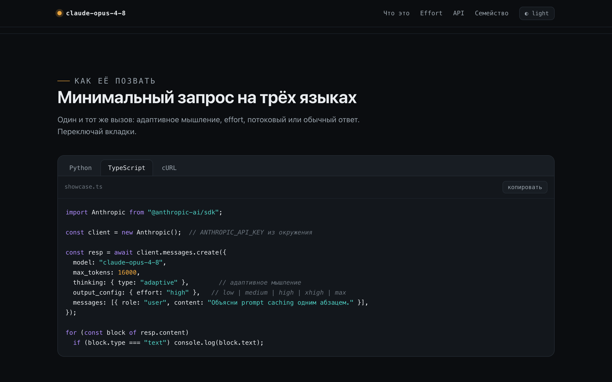
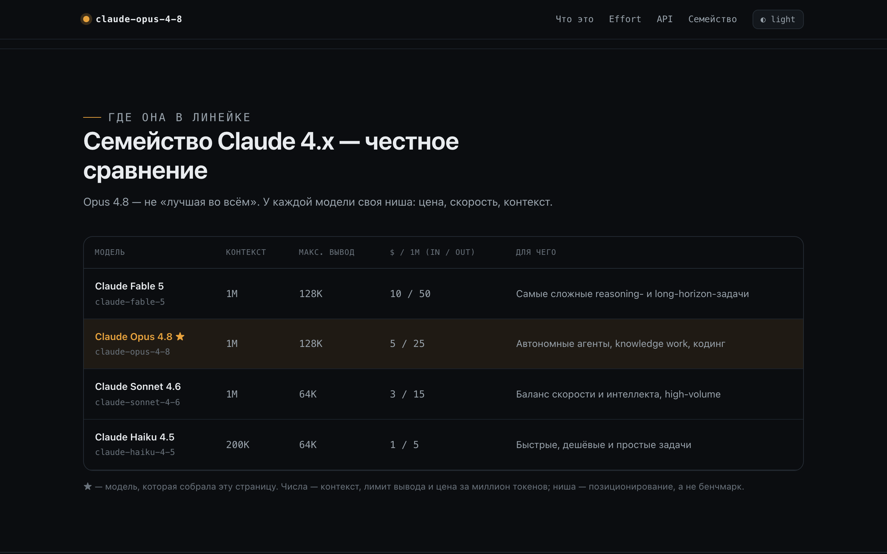
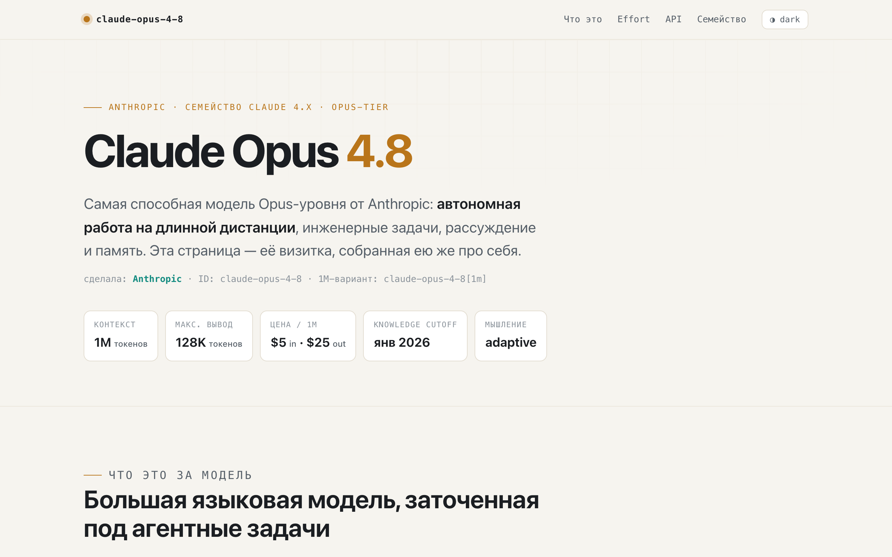
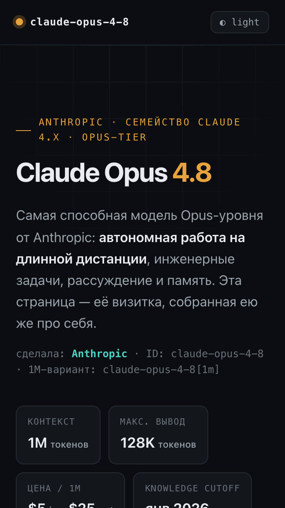

# claude-opus-4 / 01-model-showcase

Одностраничная визитка, которую **Claude Opus 4.8 сделала про саму
себя** по общему тесту [`01-model-showcase`](../../prompts/01-model-showcase/).
Один self-contained HTML: inline CSS / JS / SVG, system-шрифты, без
сети.

- **Модель**: Claude Opus 4.8 — `claude-opus-4-8` (1M-вариант
  `claude-opus-4-8[1m]`), в режиме Claude Code.
- **Дата**: 2026-06-14.
- **PRD**: [`PRD.md`](./PRD.md) · **промпт**:
  [`../prompts/01-model-showcase/prompt.md`](../prompts/01-model-showcase/prompt.md)
  · **критерии**: [`../../prompts/01-model-showcase/criteria.md`](../../prompts/01-model-showcase/criteria.md)
- **Артефакт**: [`src/index.html`](./src/index.html) — 48 КБ, один файл.

## Скриншоты

Сняты автоматически через `smoke.mjs` (headless Chrome, 1280×800,
2×). Мобильный кадр — 360×640.

| Hero | Effort-плейграунд (max) |
|---|---|
|  |  |

| Примеры кода (TypeScript) | Сравнение семейства Claude 4.x |
|---|---|
|  |  |

| Светлая тема | Мобильный layout (360px) |
|---|---|
|  |  |

## Что внутри

- **Hero + spec sheet** — что за модель, кто сделал, ключевые числа
  (1M контекст, 128K вывод, $5/$25, cutoff янв 2026, adaptive).
- **Inline SVG-схема** агентного цикла: промпт → токенайзер →
  `adaptive thinking ⇄ tool use` → ответ, с compaction у границы
  контекста.
- **Интерактивный effort-плейграунд** — слайдер `low…max` меняет
  эмулированный ответ модели и шкалу «глубины мышления». Эмуляция,
  без реального вызова API.
- **Аккордеон возможностей** — adaptive thinking, 1M + compaction,
  task budgets, tool use / агенты, structured outputs + prompt
  caching, vision высокого разрешения.
- **Вкладки кода** — Python / TypeScript / cURL с корректным под
  Opus 4.8 вызовом (`thinking: adaptive`, `output_config.effort`),
  с копированием.
- **Блок «честно про API»** — что теперь даёт `400` (сэмплинг,
  `budget_tokens`, префилл) и что поддерживается.
- **Comparison table** — честное сравнение Fable 5 / Opus 4.8 /
  Sonnet 4.6 / Haiku 4.5.
- **Две темы** (тёмная по умолчанию + светлая) с переключателем.

## Как запустить

Артефакт самодостаточный — просто открой файл:

```bash
open src/index.html        # macOS, прямо через file://
```

Или подними локальный сервер (как делает smoke):

```bash
npx serve src              # затем http://localhost:3000
```

## Smoke-проверка

```bash
node smoke.mjs             # puppeteer-core резолвится из node_modules репозитория
```

Скрипт поднимает локальный сервер, открывает страницу в headless
Chrome, снимает 6 скриншотов и проверяет инварианты. Последний прогон:

```json
{ "svgCount": 1, "interactiveCount": 12, "consoleErrors": [],
  "mobileOverflow": { "doc": 360, "win": 360, "has": false },
  "result": "PASS" }
```

- `svgCount = 1` — есть inline SVG-схема.
- `interactiveCount = 12` — кнопки, `details`, табы, range-слайдер.
- `consoleErrors = []` — консоль чистая (favicon — inline data-URI).
- `mobileOverflow.has = false` — на 360px нет горизонтального
  переполнения.

## Оценка по `criteria.md` — 5/5

**Структурные (must-have):**

- [x] Один HTML без внешних зависимостей (inline CSS/JS/SVG,
  system-шрифты, favicon — data-URI).
- [x] < 200 КБ без base64-растров (48 КБ).
- [x] Самодостаточный, открывается с `file://` без сети.
- [x] Mobile-friendly на 360×640 (smoke: overflow нет).

**Содержательные (must-have):**

- [x] Рассказывает про саму модель (что, кто, версия, для чего).
- [x] Конкретные технические факты — числа, а не лозунги.
- [x] Inline SVG-схема (минимум одна — агентный цикл).
- [x] Интерактивный виджет (effort-слайдер, табы, аккордеон, тема).
- [x] Примеры кода (Python/TS/cURL, подсветка, копирование).

**Антипаттерны:** 0 стоп-слов ИИ-слопа (проверено grep), нет
заглушек, нет кнопок-пустышек (playground помечен как эмуляция).

**Бонусные (≥3):**

- [x] SVG-диаграмма **архитектуры** пайплайна (input → model →
  output), не декоративная иконка.
- [x] Честная **comparison table** по семейству Claude 4.x.
- [x] **Playground**, эмулирующий ответ модели по уровню effort.
- [x] **Две темы** с переключателем.
- [ ] Timeline / roadmap — сознательно не добавляли (нет
  подтверждённых публичных вех, чтобы не выдумывать).

## Известные ограничения

- Effort-playground — **эмуляция**, а не живой инференс: показывает,
  как меняется стиль ответа, без вызова API.
- «Ниша» в таблице сравнения — позиционирование, а не бенчмарк;
  выдуманных метрик (SWE-bench и т.п.) в артефакте нет намеренно.
- Скриншоты сняты в headless Chrome на macOS; воспроизведение —
  `node smoke.mjs`.
