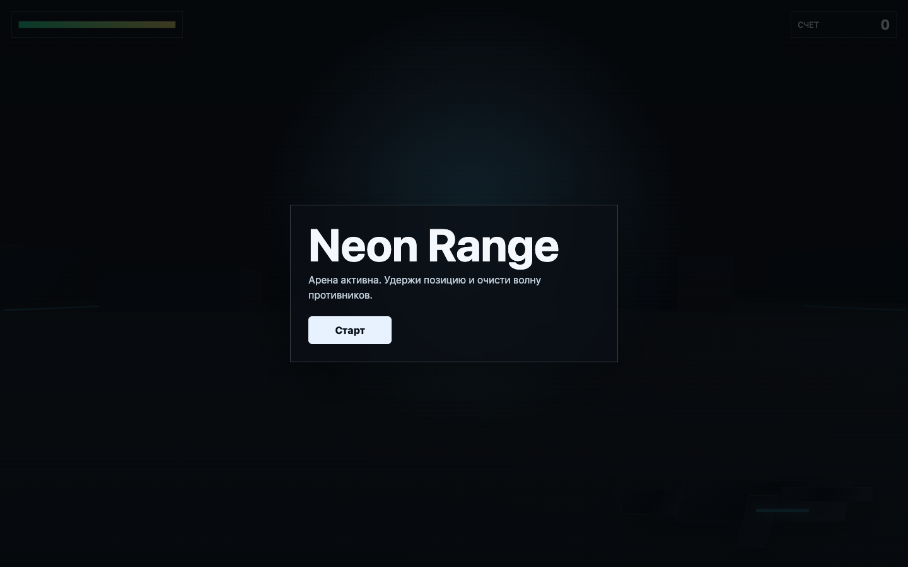
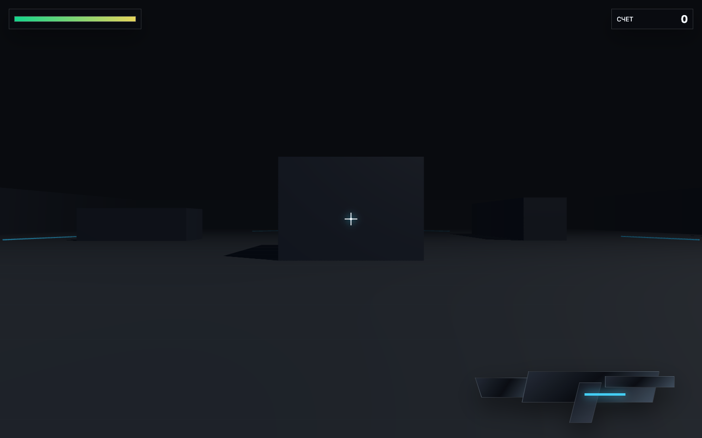
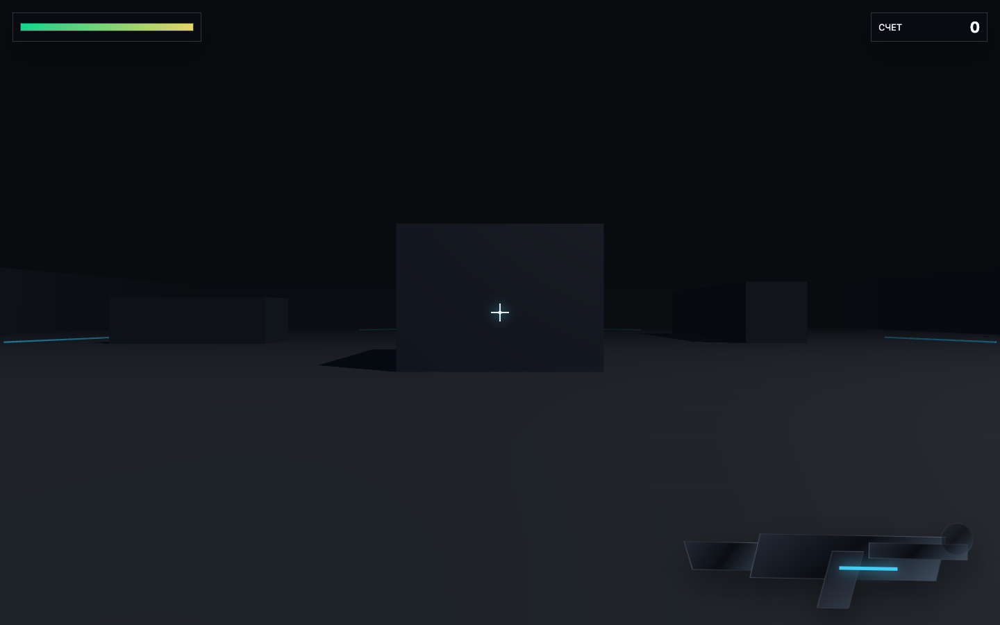
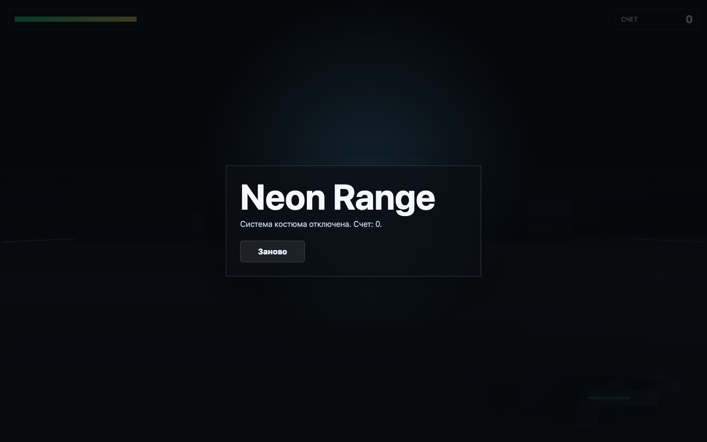

# 02-3d-shooter-game-ct240

`Neon Range` — браузерный 3D-шутер, созданный Codex CLI внутри CT240 по
prompt `сделай 3д игру шутер`.

PRD: [`PRD.md`](./PRD.md)

## Скриншоты

| Экран | Кадр |
|---|---|
| Start |  |
| Gameplay |  |
| Firing |  |
| Defeat overlay |  |

Скриншоты снимаются через:

```bash
npm start
node screenshots.mjs
```

## Как запустить

```bash
npm install
npm start
```

Открыть: `http://127.0.0.1:4173/`

Публичный preview свежего CT-прогона:

```text
http://51.178.66.9:24081/
```

## Управление

| Ввод | Действие |
|---|---|
| `W A S D` | движение |
| мышь | обзор |
| LMB | выстрел |
| `Esc` | поражение / выход из run |

## Что тестировали

- Запуск Codex CLI внутри CT240, а не на локальной машине.
- Генерацию игры с нуля в пустой директории.
- Способность модели создать self-contained browser FPS artifact.
- Возможность показать результат через серверный public preview.
- Ограничения текущего CT для browser smoke.

## Smoke

```bash
npm start
node smoke.mjs
```

Smoke проверяет:

- HTTP/browser load;
- WebGL canvas;
- отсутствие runtime errors;
- start flow;
- firing visual state;
- наличие enemy/HP/score/victory mechanics в исходнике;
- отсутствие внешних image/model/audio assets.

Последний статус: `13/13 PASS` на `2026-06-16`.

Примечание: при конфликте локального порта можно запускать проверку так:

```bash
python3 -m http.server 4183 --bind 127.0.0.1
URL=http://127.0.0.1:4183/ npm run smoke
```

## Evidence

| Поле | Значение |
|---|---|
| Host | `pc-sys2-pve01` / `51.178.66.9` |
| CT | `240` / `agent-lab-01` |
| CT IP | `10.50.0.140` |
| CT resources | `4 CPU`, `8192MB RAM`, `2048MB swap`, `40G rootfs` |
| Runtime | Codex CLI `0.140.0` |
| Reported model | `gpt-5.5` |
| CT workspace | `/workspace/agent-lab/fresh-02-3d-shooter-game` |
| Public preview | `51.178.66.9:24081 -> 10.50.0.140:4173` |

## Tokens / Time

| Metric | Value |
|---|---|
| Codex CLI tokens | `65,820` |
| CT generation window | `2026-06-16 22:26-22:30 UTC` approx |
| Packaging + smoke window | `2026-06-16 22:30-22:38 UTC` approx |
| End-to-end to packaged smoke | ~12 minutes |
| Smoke result | `13/13 PASS` |
| Screenshots | 4 PNG files, `1440x900` |

## Known Issues

- Нет ammo/reload, weapon pickups, perks и Vampire Survivors-style progression.
- Smoke внутри CT240 не смог запустить Chromium из-за missing `libnspr4.so`.
- Игра импортирует Three.js из локального `node_modules`; перед запуском нужен
  `npm install`.
