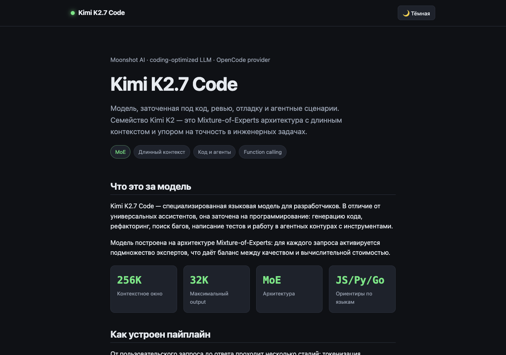
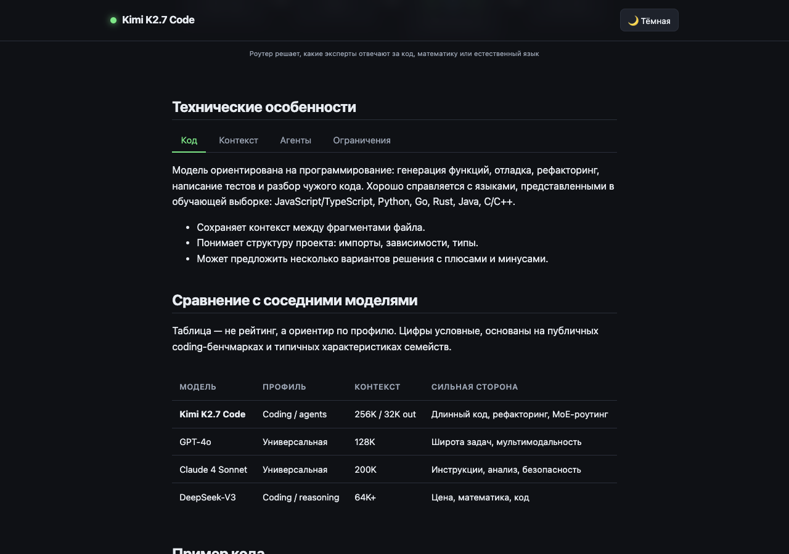
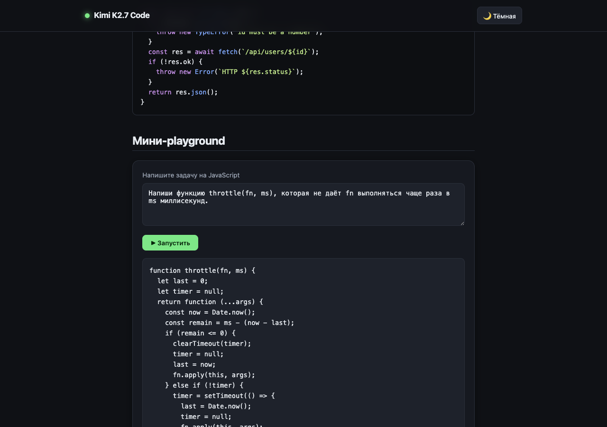

# 01-model-showcase

Тест «визитка про саму модель» для **Kimi K2.7 Code** через OpenCode (`opencode-go/kimi-k2.7-code`).

- **PRD**: [PRD.md](./PRD.md)
- **Промпт**: [../prompts/01-model-showcase/prompt.md](../prompts/01-model-showcase/prompt.md)
- **Артефакт**: [src/index.html](./src/index.html) — один HTML-файл, без внешних зависимостей.

## Скриншоты





## Что внутри

Одностраничный сайт о модели Kimi K2.7 Code:

- Factual описание модели, MoE-архитектура, длинный контекст.
- SVG-схема пайплайна: prompt → tokenizer → MoE router → output.
- Интерактивные табы с техническими особенностями.
- Сравнительная таблица с другими моделями.
- Пример кода с CSS-подсветкой.
- Мини-playground: ввод задачи → эмулированный ответ модели.
- Переключатель тёмной/светлой темы.

## Как запустить

```bash
# Просто открыть файл в браузере
open src/index.html

# Или поднять локальный сервер
python3 -m http.server 4101 --directory src
```

## Smoke-проверка

```bash
node smoke.mjs
```

Что проверяет:

1. Запускает HTTP-сервер на порту 4101.
2. Открывает страницу в headless Chromium.
3. Проверяет наличие `<svg>` и интерактивных элементов.
4. Проверяет отсутствие горизонтального overflow на 360×640.
5. Проверяет отсутствие ошибок в консоли.
6. Делает три скриншота: hero, features, playground.

### Результаты

- Дата теста: 2026-06-14
- Размер `index.html`: ~23 КБ
- SVG: 1
- Интерактивные элементы: 6
- Mobile overflow: нет
- Console errors: нет
- **Итог: PASS**

## Известные ограничения

- Playground эмулирует ответ заранее записанным сниппетом, а не вызывает настоящую модель.
- Сравнительные цифры — ориентиры, а не официальные benchmark-результаты.
- Для smoke нужен установленный Google Chrome или переменная `CHROME_BIN`.
