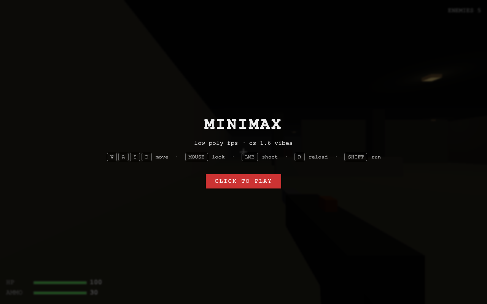
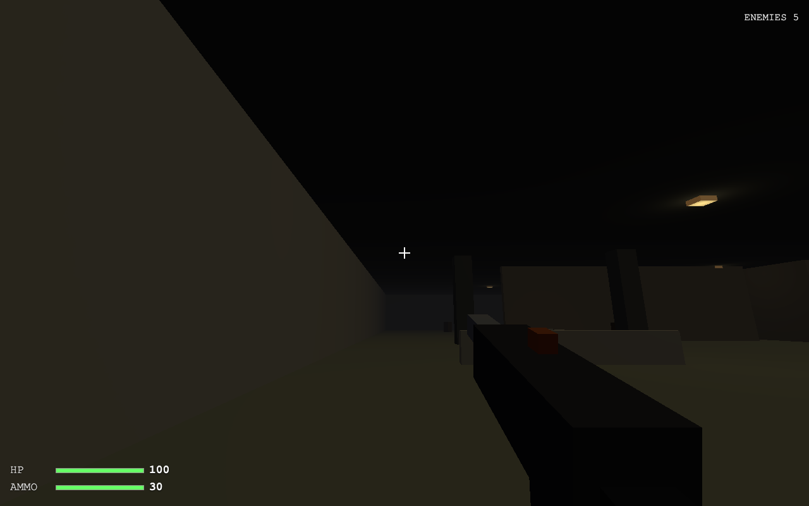
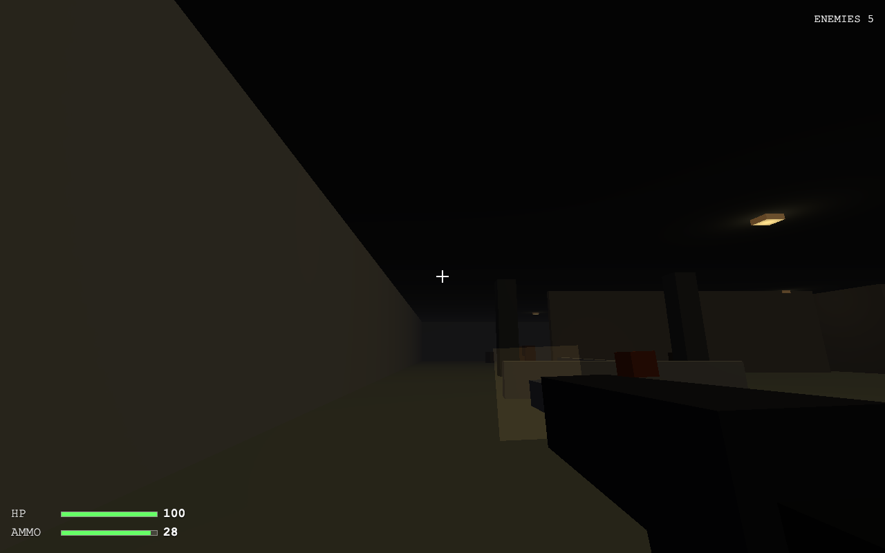
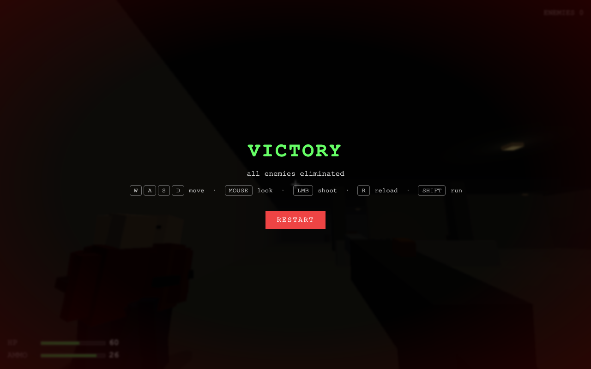

# fps-cs-lowpoly

Шутер от первого лица в браузере. Low-poly арена, Three.js, боты,
full-auto оружие, hit reaction, плавная анимация смерти. Собран,
чтобы протестировать `opencode-go/minimax-m3` end-to-end.

📋 **PRD**: [`PRD.md`](./PRD.md) — что строим, scope, метрики успеха, non-goals.

## Скриншоты

| Экран | Кадр |
|---|---|
| Title overlay |  |
| Gameplay |  |
| Стрельба (muzzle + tracer) |  |
| Победа (5/5) |  |

Скрины сняты `screenshots.mjs` через headless Puppeteer. Воспроизвести:

```bash
npm run build
npx vite preview --host 0.0.0.0 --port 4173 &
node screenshots.mjs
```

## Как запустить

```bash
npm install
npm run dev        # http://localhost:5173
# или production:
npm run build
npm run preview    # http://localhost:4173
```

## Управление

| Ввод | Действие |
|---|---|
| `W A S D` / стрелки | движение |
| `мышь` | обзор |
| `Space` | прыжок |
| `Shift` | бег |
| `LMB` (удержание) | стрельба (full-auto) |
| `R` | перезарядка |
| `Esc` | пауза |

Pointer-lock включается по первому клику на overlay «PLAY».

## Что тестирует

Две итерации на одном артефакте, обе от разных промптов:

1. **Cold-start: запускаемый билд с нуля.** Поднять Vite + Three.js
   проект без скаффолда, собрать low-poly арену, FPS-управление,
   оружие с патронами/перезарядкой, ИИ ботов (FSM), HUD и доказать
   работоспособность headless smoke-тестом.
2. **Патч из нескольких механик.** Добавить full-auto очередь,
   импакт-эффекты (muzzle flash + трассер + декаль + искры),
   hit reaction у ботов (pain-kick наклон), плавную анимацию
   смерти — без регрессии smoke-теста.

Промпты — в [`../prompts/`](../prompts/).

## Smoke-тест

`smoke.mjs` использует Puppeteer + headless Chrome с software-
растеризатором, чтобы загрузить собранную игру, симулировать ввод и
проверить:

1. **Full-auto очередь** — удержание LMB уменьшает `ammo` на ≥ 3 за
   ~0.5с
2. **Эффекты спавнятся** — трассеры / декали / искры появляются
   в середине очереди
3. **Hit reaction бота** — телепортируем бота в прицел, проверяем
   что `hp` падает и `painKick` взлетает
4. **Анимация смерти** — смертельный урон анимирует
   `deathProgress 0→1` с `body.rotation.x → -π/2`
5. **Победа** — все 5 ботов мертвы → появляется win overlay

Запуск:

```bash
npm run build
npx vite preview --host 0.0.0.0 --port 4173 &
node smoke.mjs
```

Последний прогон: **5/5 PASS**, 0 runtime-ошибок.

## Стек

- `three` 0.169 — WebGL renderer, BoxGeometry, MeshLambertMaterial с
  `flatShading` для low-poly вида
- `vite` 5 — dev-сервер + бандлер
- Vanilla JS — без UI-фреймворков, без роутера, без билд-шага
  помимо Vite-бандлинга

## Карта файлов

```
fps-cs-lowpoly/
├── README.md
├── PRD.md
├── index.html
├── package.json
├── vite.config.js
├── smoke.mjs             # Puppeteer smoke-тест (5/5 PASS)
├── screenshots.mjs       # Puppeteer screenshot-скрипт
├── screenshots/          # PNG-кадры для README + issue
│   ├── 01-start.png
│   ├── 02-gameplay.png
│   ├── 03-firing.png
│   └── 04-victory.png
└── src/
    ├── main.js           # сцена, рендер-цикл, состояние игры, auto-fire
    ├── world.js          # арена 60×60, ящики, столбы, бочки, лампы
    ├── player.js         # FPS-контроллер (WASD, прыжок, спринт, коллизии)
    ├── weapon.js         # viewmodel, muzzle flash, raycast-стрельба
    ├── bot.js            # FSM, патруль по waypoint, hit reaction, death anim
    ├── effects.js        # пул трассеров / декалей / искр с FIFO + fade
    ├── ui.js             # HP / ammo / enemies HUD, overlay
    └── utils.js          # AABB-коллизии, raycast-хелперы, синтез-бипы
```
