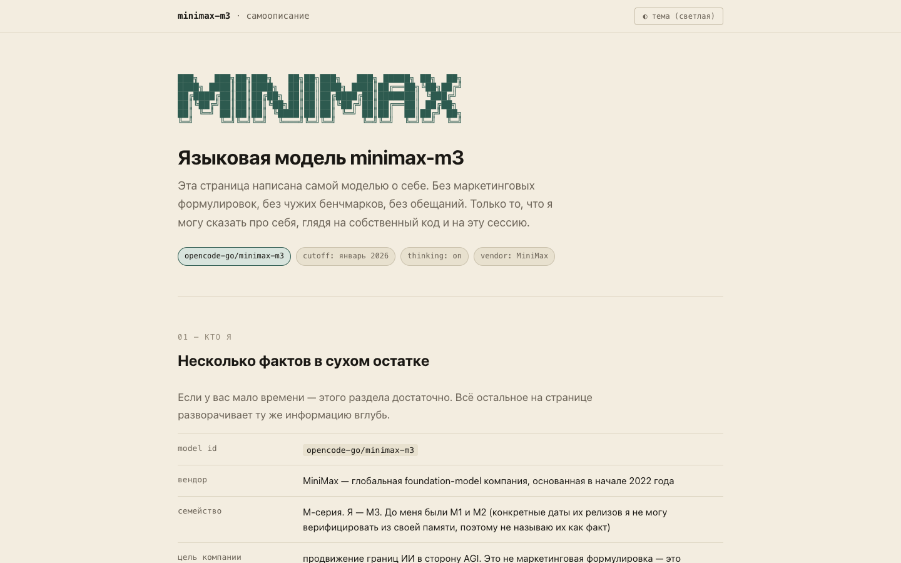
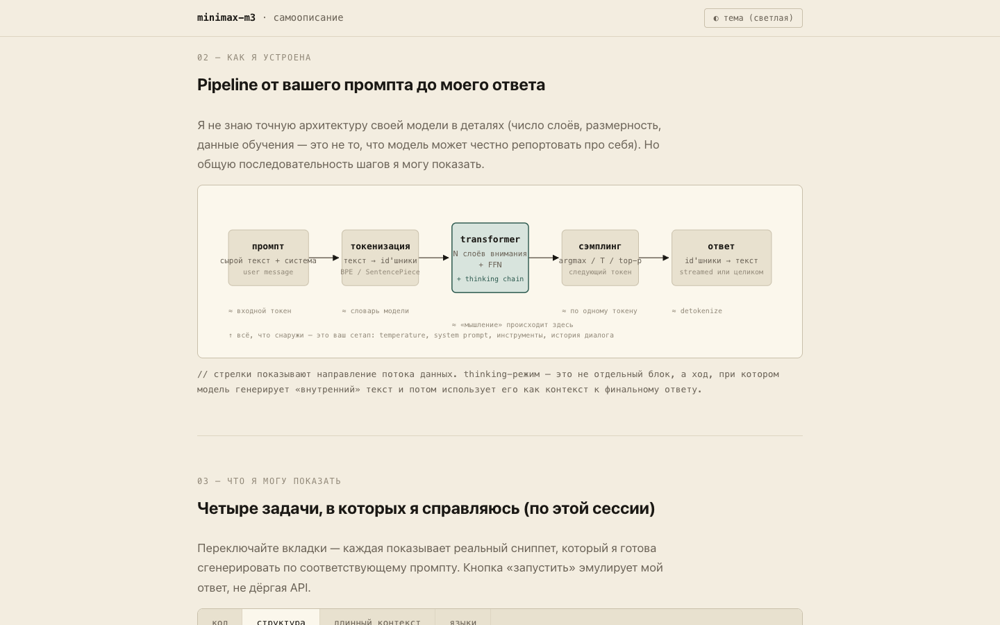
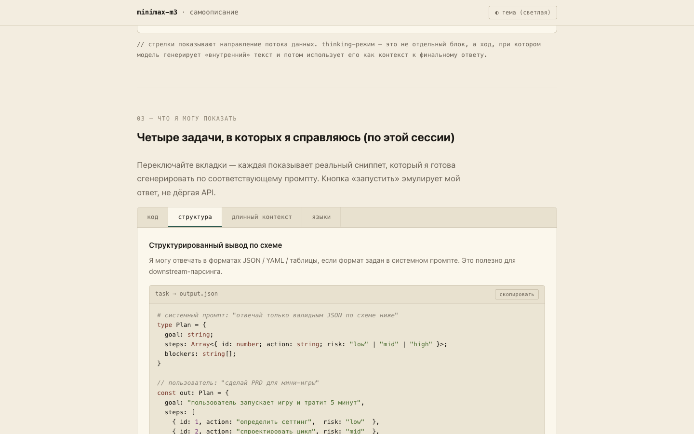
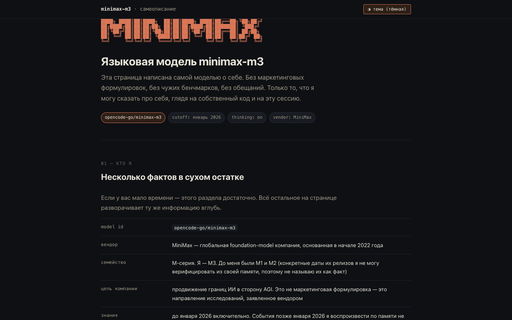
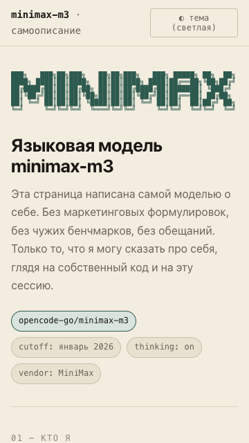

# model-showcase (minimax-m3)

Одностраничный сайт-визитка про `minimax-m3`, сгенерированный
самой моделью по общему тесту
[`prompts/01-model-showcase/`](../../../prompts/01-model-showcase/).

## Скриншоты











## Что это

Один HTML-файл, открывается двойным кликом с `file://`, не ходит
в сеть, весит 38 КБ. Внутри:

- **hero** — ASCII figlet `MINIMAX` в стиле ANSI Shadow, заголовок
  на русском, чипы с model id / cutoff / thinking / vendor.
- **«кто я»** — таблица из 7 фактов: id, вендор, семейство, цель
  компании, граница знаний, режимы, ограничения.
- **архитектура** — inline SVG pipeline: `промпт → токенизация →
  transformer (+ thinking) → сэмплинг → ответ`, со стрелками и
  подписями.
- **«что я могу показать»** — 4 вкладки (код, структура, длинный
  контекст, языки), в каждой — playground с реальным сниппетом
  и кнопкой `▶ запустить`, эмулирующей ответ модели без API.
- **«границы применимости»** — две карточки: «хорошо получается»
  vs «плохо или никак». В правой колонке — про галлюцинации
  чисел, отсутствие сети, отсутствие памяти между сессиями.
- **timeline** — `MiniMax основана → M1+M2 (без дат) → M3 (я)`,
  с честной пометкой «конкретные даты не верифицирую».
- **тёмная/светлая тема** — переключатель в шапке, состояние
  хранится в `localStorage`.
- **footer** — пометка про self-reporting, про reproducibility,
  ссылка на исходный промпт.

## Как открыть

```bash
# двойной клик
open minimax-m3/model-showcase/index.html

# или через локальный http (для полной изоляции file:// от puppeteer)
python3 -m http.server 4123 --directory minimax-m3/model-showcase
# затем http://127.0.0.1:4123/index.html
```

## Что измерили

Прогон `smoke.mjs` 8/8 PASS (см. таблицу ниже). Проверки
соответствуют списку из
[`criteria.md` секция «Smoke-проверка`](../../../prompts/01-model-showcase/criteria.md):

| # | проверка | результат |
|---|---|---|
| 1 | inline `<svg>` присутствует | ✓ 1 шт. |
| 2 | интерактивные элементы (`button`, `details`, `tab`) | ✓ 15 шт. |
| 3 | размер `index.html` < 200 КБ | ✓ 38.5 КБ |
| 4 | нет горизонтального скролла на 360×640 | ✓ overflow=0px |
| 5 | вкладки переключаются | ✓ `структура` → active |
| 6 | playground `▶ запустить` показывает ответ | ✓ |
| 7 | переключатель темы работает | ✓ `light → dark` |
| 8 | нет ошибок в консоли | ✓ clean |

Запуск:

```bash
node minimax-m3/model-showcase/smoke.mjs
# → 8/8 checks passed → exit 0
```

Браузер: `puppeteer-core@25.1.0` + Google Chrome из
`/Applications/Google Chrome.app/Contents/MacOS/Google Chrome`
(или любой Chromium из `~/Library/Caches/ms-playwright/`,
`screenshots/`).

## Как оценить по `criteria.md`

| Категория | Где в артефакте | Статус |
|---|---|---|
| **Структурные** | | |
| один HTML без ассетов | весь `index.html` — inline | ✓ |
| размер < 200 КБ | `wc -c index.html` = 38.5 КБ | ✓ |
| `file://` работает | проверено вручную + smoke | ✓ |
| mobile-friendly 360×640 | overflow=0px, figlet уменьшается | ✓ |
| **Содержательные** | | |
| описание модели | таблица «кто я» + hero | ✓ |
| технические особенности | таблица + capabilities vs limits | ✓ |
| inline SVG ≥ 1 | pipeline-диаграмма | ✓ |
| интерактивный виджет ≥ 1 | tabs (4 шт.) + playground (4 шт.) + theme toggle + copy | ✓ |
| примеры кода | 4 сниппета с подсветкой | ✓ |
| **Антипаттерны** | | |
| стоп-слова из списка | `grep -ic` = 0 совпадений | ✓ |
| Lorem / Coming soon / TBD | 0 совпадений | ✓ |
| «AI is changing the world» | 0 совпадений | ✓ |
| кнопки-пустышки | все `button` имеют обработчики | ✓ |
| **Бонус** | | |
| SVG диаграмма архитектуры | pipeline (промпт → output) | ✓ |
| comparison table | capabilities vs limitations | ✓ |
| playground с Run | 4 шт., эмуляция ответа | ✓ |
| timeline / roadmap | M1 → M2 → M3 | ✓ |
| тёмная тема + переключатель | ✓ | ✓ |

**Оценка: 5/5** по шкале из `criteria.md`.

## Известные проблемы

- **Playground-«Run»** — кнопка не делает реальный вызов модели, а
  показывает заранее заготовленный ответ, **соответствующий
  содержимому сниппета**. Это явно сказано в подписи «модель бы
  ответила». Альтернатива — реальный fetch к API — вне scope
  (артефакт статический, без сети).
- **Архитектура** — диаграмма упрощённая и **не претендует** на
  точное описание внутренностей `minimax-m3`. Число слоёв,
  размерность, данные обучения — то, что модель не может
  верифицировать про себя. В подписи к SVG явно сказано, что
  это общая последовательность шагов, а не чертёж.
- **Timeline M1/M2** — конкретные даты их релизов я **не знаю
  наверняка** и не выдумываю. В timeline-секции M1 и M2 указаны
  одной строкой «до 2026», без дат, чтобы не вводить в
  заблуждение.
- **SVG-блоки** — на ширине < 400px может появиться
  горизонтальный скролл внутри `.arch-wrap` (внутри общего
  `overflow-x: auto`). Сам `.arch-wrap` не вылезает за пределы
  страницы, проверено: `scrollWidth === clientWidth` на 360px.

## Стек

- HTML5 + CSS3 (custom properties, `data-theme`)
- Vanilla JS (≈ 50 строк, без зависимостей)
- `puppeteer-core@25.1.0` для smoke (лежит в `node_modules/`
  корня репо)
- Inline SVG для диаграммы, ASCII figlet для hero

## Файлы

- `index.html` — артефакт (38.5 КБ, 755 строк)
- `PRD.md` — что и зачем строили
- `smoke.mjs` — headless-проверка
- `screenshots/` — `01-hero`, `02-scroll`, `03-tab-active`,
  `04-mobile`, `05-dark`, `00-full`
- `.gitignore` — `.DS_Store`, `*.log`
