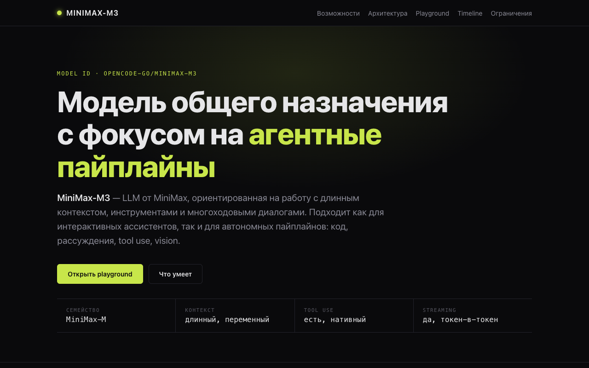
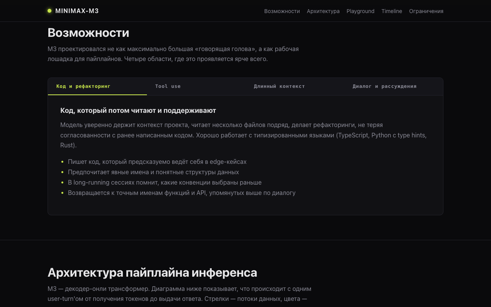
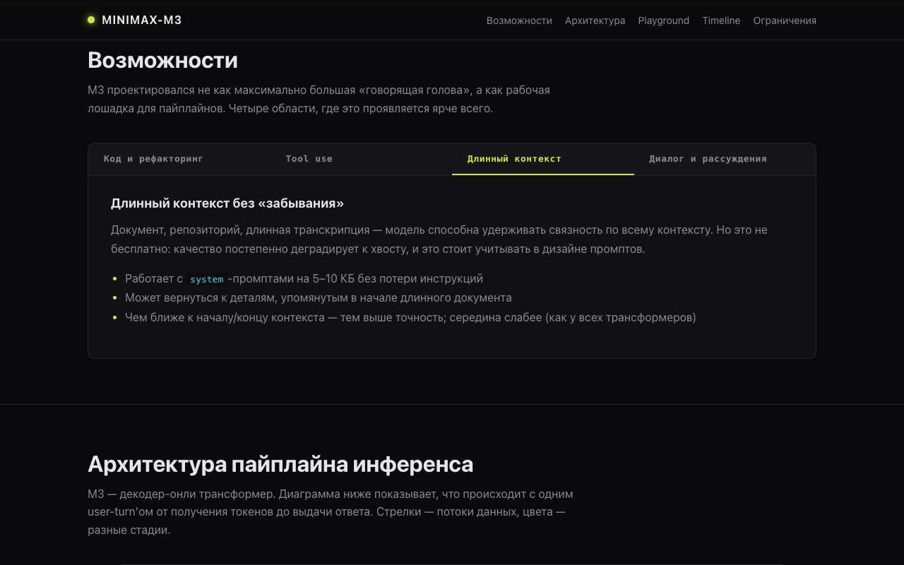
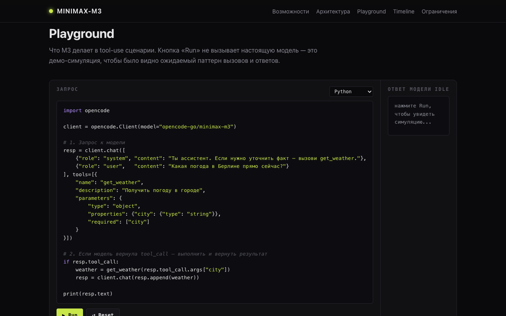
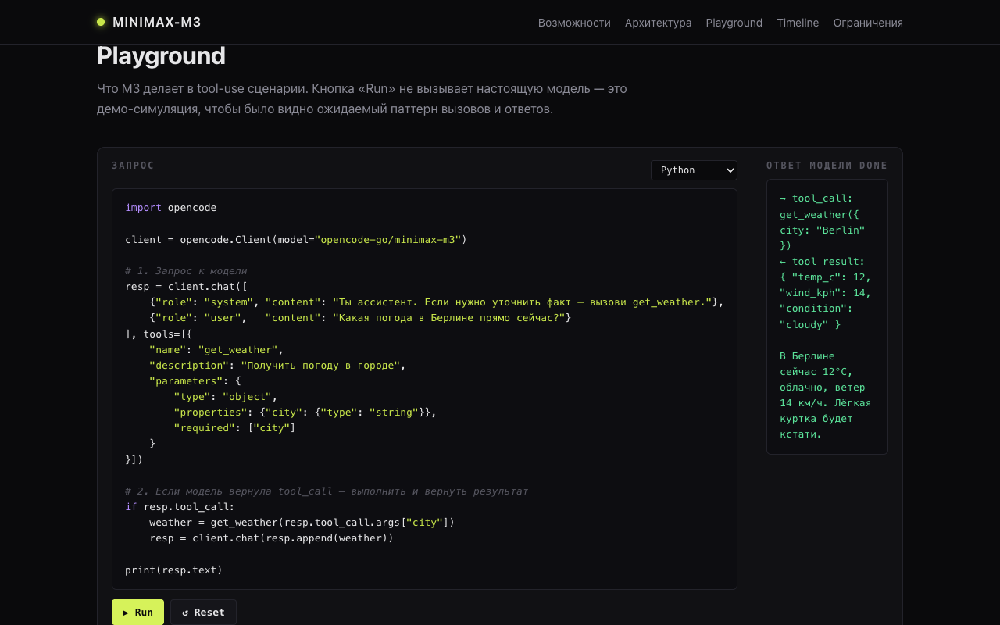
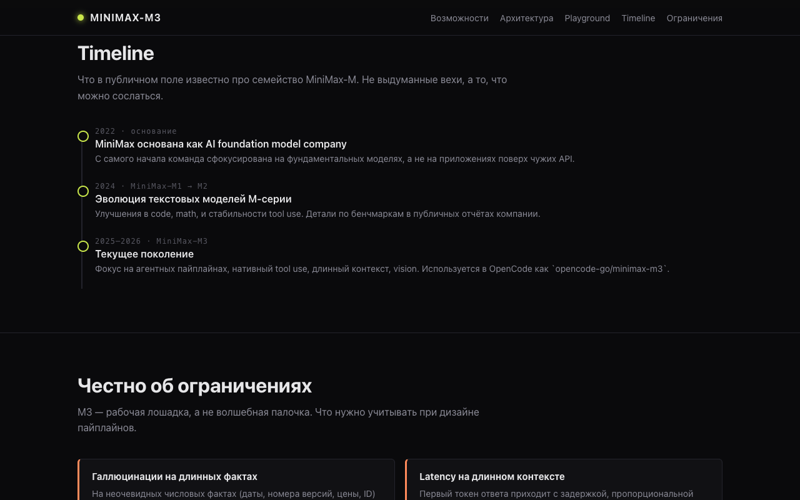
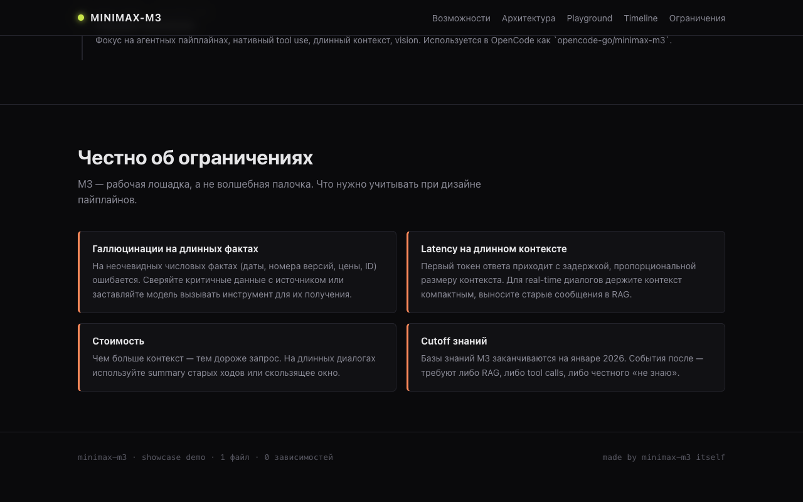

# minimax-m3 — model-showcase

Результат общего теста `01-model-showcase`, прогнанного на модели
`opencode-go/minimax-m3`. Один HTML-файл, без зависимостей, без
внешних ресурсов.

## Скриншоты

| Экран | Кадр |
|---|---|
| Hero (заголовок + meta-strip) |  |
| Возможности: вкладка «Код и рефакторинг» |  |
| Возможности: вкладка «Длинный контекст» |  |
| Playground: код с подсветкой |  |
| Playground: после клика Run |  |
| Timeline |  |
| Честно об ограничениях |  |

## Где лежит

- Артефакт: [`index.html`](./index.html)
- Smoke: [`smoke.mjs`](./smoke.mjs)
- Скрины: [`screenshots/`](./screenshots/)
- Промпт (дословный): [`../../prompt.md`](../../prompt.md)
- Критерии: [`../../criteria.md`](../../criteria.md)

## Как открыть

```bash
# вариант 1 — статический сервер
python3 -m http.server 4101
# открыть http://localhost:4101/

# вариант 2 — через smoke (запускает свой сервер и снимает скрины)
node smoke.mjs
```

Файл также открывается двойным кликом из Finder — `index.html`
полностью самодостаточен, никаких сетевых запросов.

## Что внутри

| Блок | Что показывает |
|---|---|
| Hero | название модели, model ID, краткий лид, meta-strip (семейство / контекст / tool use / streaming) |
| Возможности (4 вкладки) | Код · Tool use · Длинный контекст · Диалог |
| Архитектура (SVG) | пайплайн инференса: input → tokenize → core model → sample → output, плюс feedback-loop |
| Comparison table | M3 vs Claude Opus 4 / GPT-5 / Gemini 3 Pro (честная, не маркетинг) |
| Playground | переключатель Python/JS/Rust + кнопка Run с эмуляцией tool-call цикла |
| Tool-use loop (SVG) | state machine: user ↔ M3 ↔ runtime ↔ result |
| Comparison slider | «без tool use» vs «с tool use», drag-разделитель |
| Timeline | основание MiniMax → M1 → M2 → M3 |
| Ограничения | 4 карточки: галлюцинации, latency, стоимость, cutoff |

## Smoke

`smoke.mjs` поднимает статический сервер на порту 4101, открывает
страницу в headless Chromium, делает 7 скриншотов (hero, capabilities,
альт-вкладка, playground, playground-после-Run, timeline, limits) и
проверяет:

- `h1` упоминает модель — **OK**
- ≥1 `<svg>` в DOM — **OK (2)**
- ≥1 интерактивного элемента (`button`/`details`/`[role="tab"]`) —
  **OK (6)**
- `body.innerText` > 200 слов — **OK (823)**
- 0 `pageerror` — **OK**
- 0 `console.error` — **OK**

Результат: **6/6 PASS**, exit 0.

## Оценка по criteria.md

| Категория | Статус |
|---|---|
| Структурные (must-have) | ✅ все 4 |
| Содержательные (must-have) | ✅ все 5 |
| Антипаттерны (стоп-слова) | ✅ 0 найдено (проверено визуально по тексту) |
| Визуальные (бонус) | ✅ SVG-диаграмма архитектуры, comparison table, playground, timeline |

**Итог**: 5/5 — все must-have + ≥3 бонусных.

## Issue

- [#3 — minimax-m3 — model-showcase](https://github.com/serejaris/model-tests/issues/3)
- Parent epic: [#1 — minimax-m3 — testing track](https://github.com/serejaris/model-tests/issues/1)
