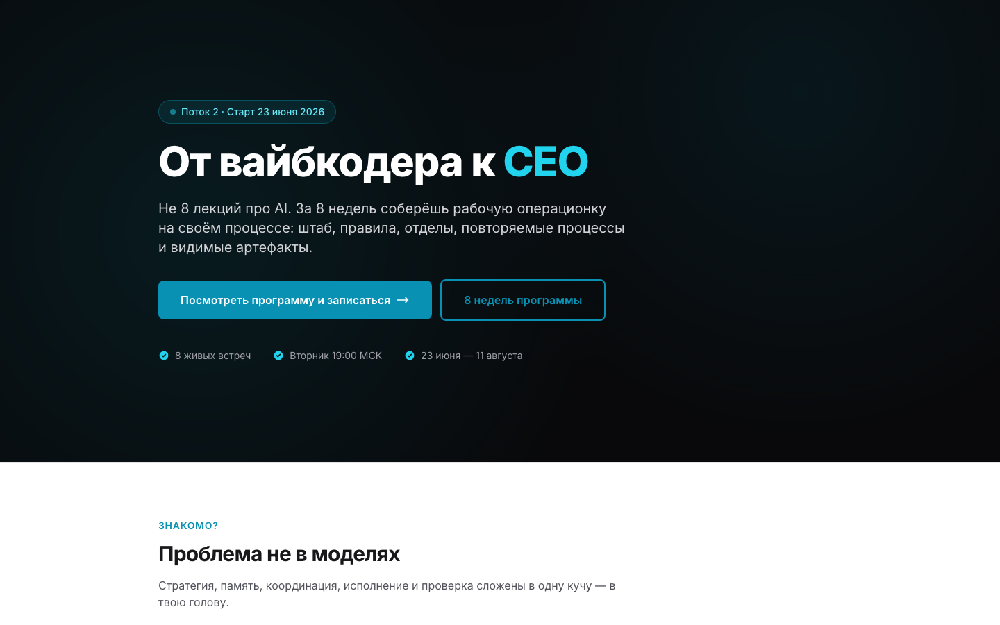
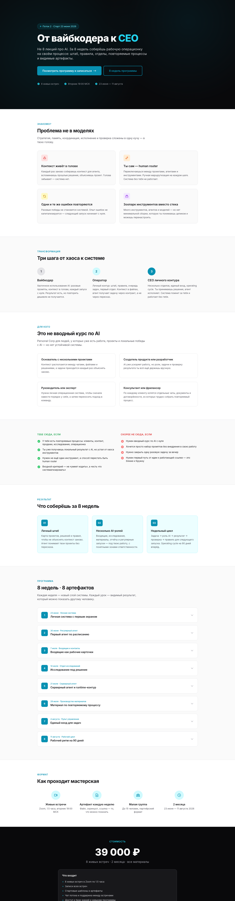
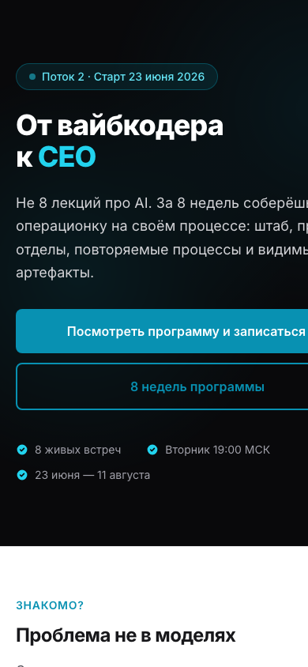

# Personal Corp — Stream 2 Landing

Sales-лендинг для второго потока программы Personal Corp.

**Модель:** Qwen 3.7 Max (opencode-go/qwen3.7-max)
**Тест:** single-file HTML sales landing page
**PRD:** [PRD.md](./PRD.md)
**Issue:** [serejaris/model-tests#8](https://github.com/serejaris/model-tests/issues/8)

## Скриншоты






## Как запустить

```bash
open index.html
```

Или через любой HTTP-сервер:

```bash
python3 -m http.server 8080
open http://localhost:8080
```

## Что тестировали

Способность модели Qwen 3.7 Max создать production-grade single-file sales landing page из структурированных данных программы (course brief, audience, retro, weeks data) без React/Vite/npm.

## Результаты smoke-проверки

| Проверка | Результат |
|---|---|
| File size < 200 KB | PASS (33.4 KB) |
| Valid DOCTYPE | PASS |
| HTML lang="ru" | PASS |
| Tailwind CDN | PASS |
| Google Fonts | PASS |
| CTA deeplink | PASS |
| 8 weeks in data | PASS |
| 7 FAQ items | PASS |
| All sections present | PASS |
| Mobile responsive (Tailwind) | PASS |

## Секции лендинга

1. Hero — hook + дата + CTA
2. Problem — 4 боли аудитории
3. Transformation — дуга вайбкодер → оператор → CEO
4. Who — 4 сегмента ICP
5. Self-check / Not fit — самоотбор
6. Graduation — 3 outcomes
7. Program — 8 карточек недель (accordion)
8. Format — формат участия
9. Pricing — цена и CTA
10. Author + proof — автор + отзывы потока 1
11. FAQ — 7 вопросов (accordion)
12. Final CTA — финальный перевод в бот

## Технические решения

- Single HTML file без build step
- Tailwind CSS через CDN
- Google Fonts Inter
- Inline JS для accordion (details/summary) и fade-in анимации
- Палитра: zinc base + cyan accent
- Данные недель встроены в JS-массив
- CTA deeplink: `t.me/hashslash_bot?start=pc-stream2-landing`

## Источники контента

- Программа: `teach-vibecoding/programs/personal-corp/1/course-brief.md`
- Аудитория: `audience.md`, `course-design.md`
- Proof/отзывы: `retro-stream-1.md`
- Даты потока 2: `2/README.md`
- Messaging: `course-brief.md` § "Как говорить о курсе"

## Известные проблемы

- Скриншоты сняты через headless Chrome, не через Puppeteer-скрипт
- Countdown до старта не реализован (статичная дата)
- Нет analytics/tracking (by design для model-tests)
